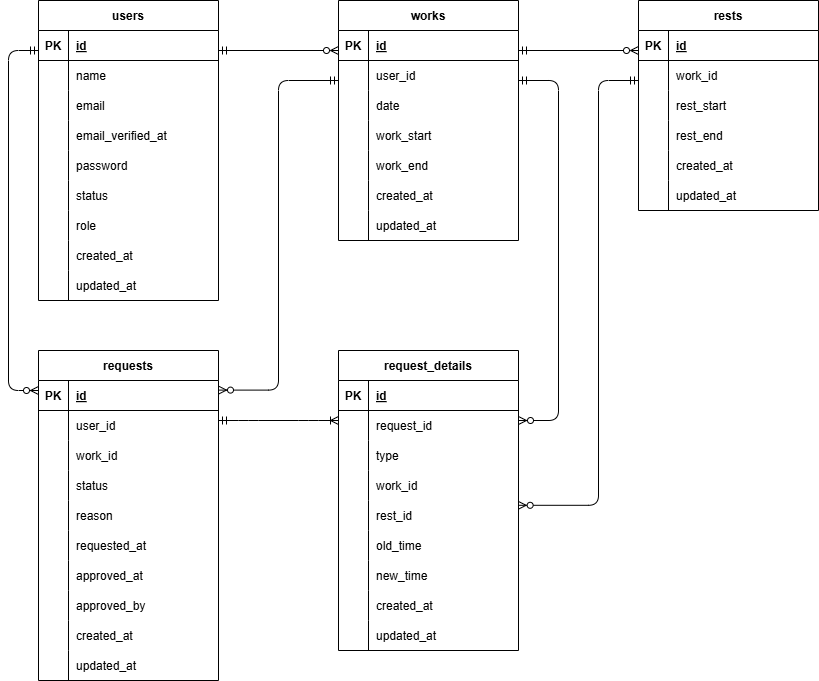

# "COACHTECH 勤怠管理アプリ"

## 作成した目的
    ユーザーの勤怠と管理。
    他社サービスは機能や画面が複雑で使いづらいため。

## アプリケーションURL
    - 開発環境：
        http://localhost/login（ユーザーログイン画面）
        http://localhost/admin/login（管理者ログイン画面）            
    - phpMyAdmin:http://localhost:8080/

## 機能一覧
    - ユーザー登録（メール認証付き）、ユーザー/管理者ログイン、ログアウト機能
    - ユーザー：勤怠打刻、勤怠情報取得、勤怠詳細の修正申請、承認待ち/済み情報取得
    - 管理者：勤怠情報取得、勤怠詳細の修正、修正申請の承認機能、スタッフ情報取得、スタッフ毎月次勤怠一覧取得/CSV出力

## 使用技術（実行環境）
    - PHP 8.1
    - Laravel 8
    - MySQL 8.0.26

## テーブル設計

## ER図

## 環境構築

### Dockerビルド
    1. [git clone リンク](git@github.com:HarukoS/AttendanceManagement.git)
    2. docker-compose up -d --build
    *MySQLは、OSによって起動しない場合があるのでそれぞれのPCに合わせてdocker-compose.ymlファイルを編集してください。

### Laravel環境構築
    1. docker-compose exec php bash
    2. composer install
    3. .env.exampleファイルから.envを作成し、環境変数を変更
        MAIL_FROM_NAME="Coachtech Attendance Management App"
    4. php artisan key:generate
    5. php artisan migrate
    6. php artisan db:seed
    7. php artisan storage:link

### ダミーデータ説明
## ユーザー一覧
    1. Name: 管理者
       Email: admin@gmail.com
       Role: Admin
    2. Name: 鈴木太郎
       Email: user1@gmail.com
       Role: User
    3. Name: 鈴木花子
       Email: user2@gmail.com
       Role: User
    ※パスワードは全て"password"

## 勤怠データ一覧
    ダミーデータのユーザー2と3につき、10日ずつ（2025/12/22～2026/1/9の平日）、9:00～18:00の勤務データ

## 休憩データ一覧
    各勤務日につき、12:00～13:00の休憩データ
    
## mailhog
    URL: http://localhost:8025

### PHP Unitテスト環境構築
    1. MySQLコンテナ上でテスト用データベース作成
        $ mysql -u root -p
        > CREATE DATABASE demo_test;
        > SHOW DATABASES;
    2. .envファイルをコピーして.env.testingを作成し、環境変数を変更
    3. php artisan key:generate --env=testing
    4. php artisan config:clear
    5. php artisan migrate --env=testing
    6. php artisan test --testsuite=Feature
